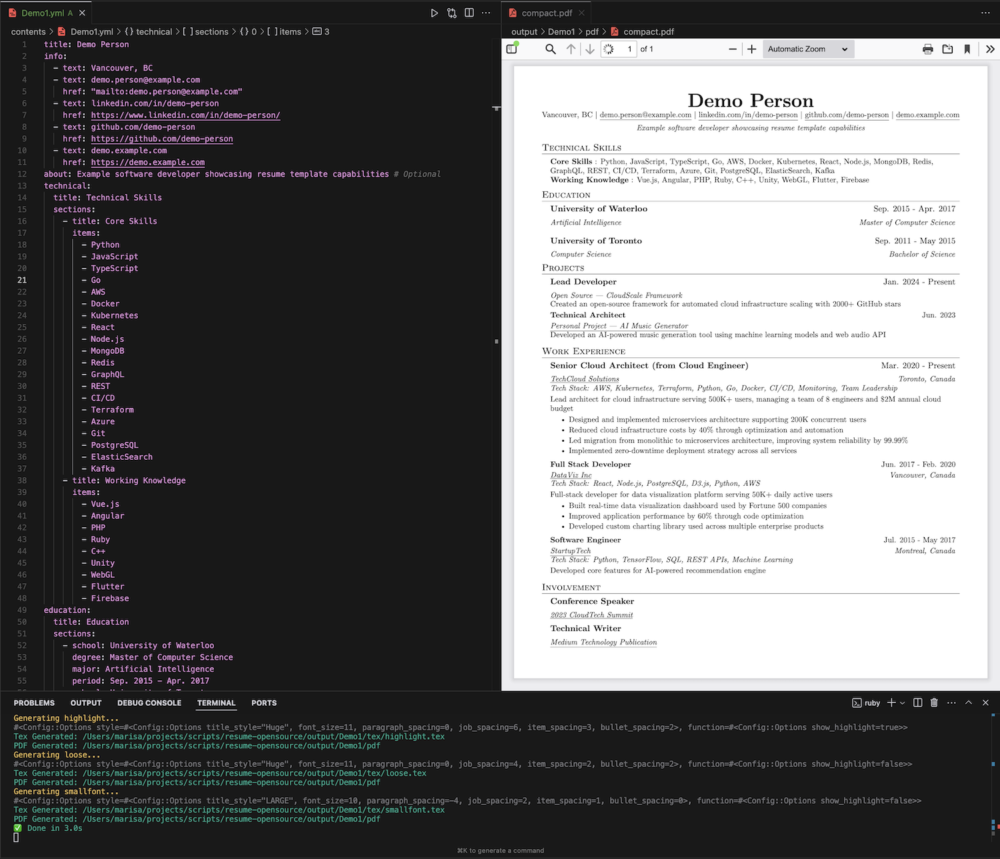

# LaTeX Resume Generator

A Ruby script that generates professional resumes in PDF format from YAML content using LaTeX templates. Features multiple styling configurations and live reload capabilities.



## Features

- Generate ATS-friendly PDF resumes from YAML content
- Multiple style configurations (compact, loose, different font sizes)
- Live reload - automatically regenerates PDF when files change
- Markdown-style bold text support
- Customizable spacing and formatting
- Support for links and special LaTeX characters

## Prerequisites

- Ruby
- MiKTeX (LaTeX distribution)
  - Download from: https://miktex.org/download
- Bundler (Ruby package manager)

## Installation

1. Clone the repository

2. Install Ruby dependencies:
```bash
bundle install
```

## Usage

### 1. Content Configuration

Create or edit YAML files in the `contents/` directory. See example structure:

```yaml
title: Demo Person
info:
  - text: Vancouver, BC
  - text: demo.person@example.com
    href: "mailto:demo.person@example.com"
  - text: linkedin.com/in/demo-person
    href: https://www.linkedin.com/in/demo-person/
  - text: github.com/demo-person
    href: https://github.com/demo-person
  - text: demo.example.com
    href: https://demo.example.com
about: Example software developer showcasing resume template capabilities # Optional
```

### 2. Style Configuration

Edit or create YAML files in `config/` directory to customize styling:

- `default.yml` - Base configuration
- `compact.yml` - Compressed spacing
- `loose.yml` - Relaxed spacing
- `smallfont.yml` - Smaller font size
- `biggerfont.yml` - Larger font size
- `highlight.yml` - Enable bold text highlighting

### 3. Generate Resume

#### One-time generation:
```bash
ruby generate.rb
```

#### Watch mode (auto-regenerate on changes):
```bash
ruby watcher.rb
```

The script will monitor:
- Content files (`contents/*.yml`)
- LaTeX template (`template.tex.erb`)
- Generator script (`generate.rb`)
- Configuration files (`config/*.yml`)

## Output

Generated files will be placed in:
- `output/<content_name>/tex/` - LaTeX source files
- `output/<content_name>/pdf/` - Generated PDF files

## Tips

- Use `**text**` in YAML content for bold text (when highlight configuration is enabled)
- Use Visual Studio Code's word wrap (Opt/Alt + Z) for easier YAML editing
- Multiple resume versions can be created by using different config files
- LaTeX template can be customized in `template.tex.erb`

## File Structure

```
├── config/           # Style configurations
├── contents/         # Resume content in YAML
├── output/          # Generated files
│   └── <name>/
│       ├── tex/     # LaTeX source
│       └── pdf/     # PDF output
├── generate.rb      # Main generator script
├── watcher.rb       # File watcher for live reload
├── template.tex.erb # LaTeX template
└── README.md
```

## License

The base format of the LaTeX template is derived from [sb2nov/resume](https://github.com/sb2nov/resume), used under the MIT License.

```
            DO WHAT THE FUCK YOU WANT TO PUBLIC LICENSE
                    Version 2, December 2004

 Copyright (C) 2024 Jin Xu <sojingle@gmail.com>

 Everyone is permitted to copy and distribute verbatim or modified
 copies of this license document, and changing it is allowed as long
 as the name is changed.

            DO WHAT THE FUCK YOU WANT TO PUBLIC LICENSE
   TERMS AND CONDITIONS FOR COPYING, DISTRIBUTION AND MODIFICATION

  0. You just DO WHAT THE FUCK YOU WANT TO.
```